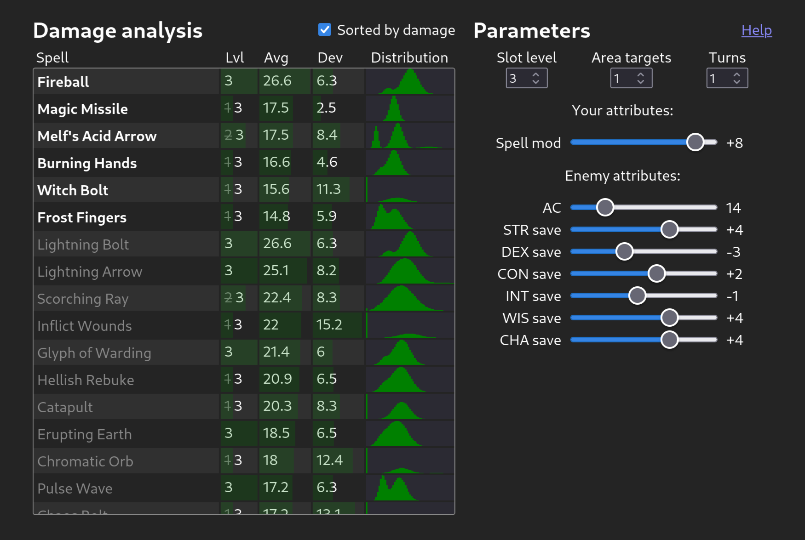

# Dnd Max

Calculate, visualize and compare damage output for your Dungeons & Dragons 5e spells (and others).

Supports custom spells and does the probabilities for you.

[Try it out here!](https://kovaxis.github.io/dndmax)

## Features

- Easily compare average damage of many spells at once.
- Visualize how different parameters like your spell modifier or your enemies' stats affect the damage of your spell.
- Includes spells for D&D 5e (currently up to level 3 spells).
- Compare damage consistency at a glance with damage distribution graphs.
- Prepare/pin spells to focus on a subset of all available spells.
- Add your own spells using a simple spell formula system, like `My Spell: 2+2d4`.
- Add your own custom parameters to analyze in as much detail as you like.
- Save, edit and manage your spell collections.
